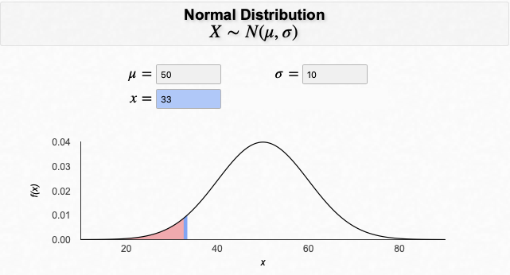
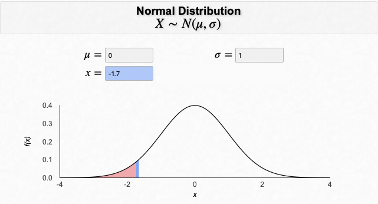
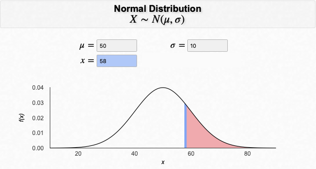
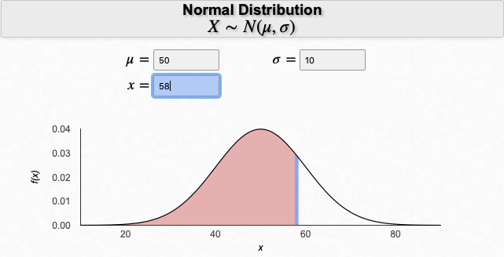
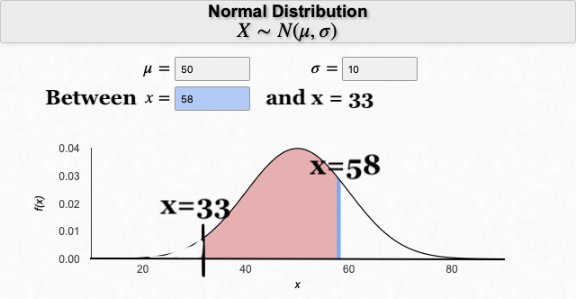
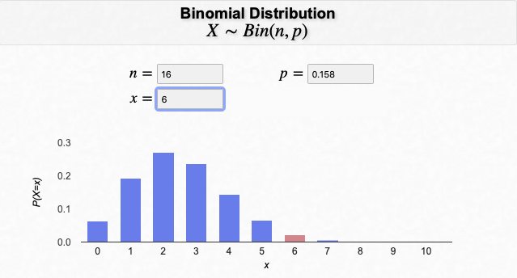
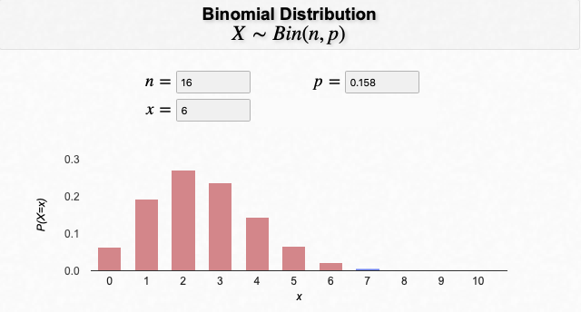
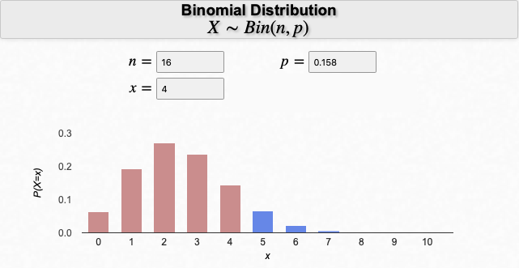
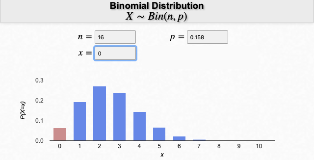
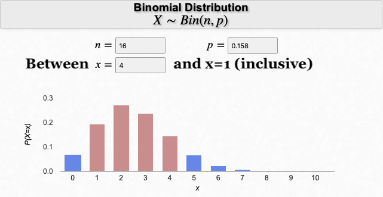

# Normal Binomial in R


## Goal of Software Lesson 2
::: {.graybox}

The goal of this software lesson is to learn how to

* compute probabilities for the Normal distribution, and
* compute probabilities for the Binomial distribution.

:::

<br>

In this software lesson, rather than having data from a sample and computing summaries of the variables in the data set, you are going to pretend that you know the underlying true theoretical distribution of some phenomenon. From this information, you can compute the probability that some event will occur. 

## Computing probabilities using the Normal distribution

Many standardized tests are calibrated to produce a Normal distribution. One such test is called the RAND-36 test, which is a measure of health-related quality of life. One of the scores produced is a mental health score. It is assumed to be normally distributed with a mean of 50 and a standard deviation of 10. 

To find probabilities from a Normal distribution, you will use the function `pnorm()`. This function finds the probability of being less (or greater than) than `X` in a Normal distribution that has a mean equal to `a` and a standard deviation equal to `b`, where `X`, `a`, and `b` need to be specified.

### Computing "less than" probabilities in a Normal distribution

Suppose you are interested in finding the probability of having **at most** a RAND-36 mental health score of 33 (i.e., 33 or less). To visualize this:

<center> </center>


- To compute "less than" probabilities using the Normal distribution (value not standardized), use the `pnorm()` function, specifying the value of interest and the arguments `mean=` and `sd=`:


``` r
pnorm(33, mean = 50, sd = 10)
```

Now suppose that the score of 33 had been standardized. Then its z-score would be -1.7 (i.e., z = $\frac{33-50}{10}$). If the value of interest is standardized, then you do not need to specify the mean and standard deviation in the `pnorm()` function because its default (or preset) values for the mean and standard deviation are 0 and 1, respectively; that is, the default values are set to the Standard Normal distribution values. To visualize this:


<center> </center>
 


- To compute "less than" probabilities using the Normal distribution AND standardized values, use the `pnorm()` function, specifying the standardized value of interest: 


``` r
pnorm(-1.7)
```

### Computing "greater than" probabilities in a Normal distribution

Now suppose you are interested in finding the probability of having **at least** a RAND-36 mental health score of 58 (i.e., 58 or more). To visualize this:

<center> </center>


There are two ways you can compute this value in R: `pnorm(..., lower.tail=FALSE)` or `1-pnorm(...)`.

**Option #1**

- To compute "greater than" probabilities using the Normal distribution (value not standardized), use the `pnorm()` function with same arguments as above and also including `lower.tail=FALSE`:


``` r
pnorm(58, mean = 50, sd = 10, lower.tail = FALSE)
```

The `lower.tail=FALSE` argument tells R to not compute the lower tail probability, but rather inverse of that: the upper tail probability.

**Option #2**

- To compute "greater than" probabilities using the Normal distribution (value not standardized), subtract the `pnorm()` function, specifying the value of interest and the arguments `mean=` and `sd=`, from 1:


``` r
1 - pnorm(58, mean = 50, sd = 10)
```

### Computing "between" probabilities in a Normal distribution

Lastly, suppose you are interested in finding the probability of a RAND-36 mental health score being between 33 and 58. Due to how the `pnorm()` function works, you need to subtract two probabilities from one another (the probability of the upper value minus the probability of the lower value). To visualize this:

<center> <b> MINUS </b>  <b> EQUALS </b>
<p>
 </p>
</center>

- To compute "between" probabilities using the Normal distribution (value not standardized), subtract the two `pnorm()` functions, specifying the upper value in the first function and the lower value in the second function:


``` r
pnorm(58, mean = 50, sd = 10) - pnorm(33, mean = 50, sd = 10)
```

::: {.bluebox}
**COMPUTING PROBABILITIES USING THE NORMAL DISTRIBUTION**

<b>Purpose:</b> To compute probabilities of some event occurring when the distribution is known to be normally distributed.

<br>
<div style="border-bottom: 1px dashed black"></div>
<br>

For additional R resources on normal distribution functions, see: 

* <a href="https://cosmosweb.champlain.edu/people/stevens/webtech/R/Chapter-6-R.pdf">Using R: Normal Distributions [Champlain College].</a>
* <a href="https://www.youtube.com/watch?v=peEsXbdMY_4&feature=emb_logo">{Normal Distribution, Z Scores, and Normal Probabilities in R [MarinStatsLectures].</a>

:::

## GUIDED QUESTIONS {#g21}

##### Question 1
What is the probability of having at most a RAND-36 mental health score of 33?

##### Question 2
What is the probability of finding RAND-36 mental health scores between 33 and 58?

::: {.graybox}

See \@ref(answers-2) for answers

:::

## Computing probabilities using the Binomial distribution

Suppose the RAND-36 mental health score is converted into a categorical variable-`Normal` and `Frail`-and suppose the probability of being `Frail` is 15.8%. Because the variable is binary and has a set probability for the event of interest, one could consider this distribution to be Binomial and be able to answer probability questions.

### Computing "equal to" probabilities in a Binomial distribution

If you obtained a random sample of 16 people, what is the probability that 6 of them will be classified as `Frail` on the RAND-36 mental health assessment? To visualize this:

<center> </center>


- To compute "equal to" probabilities using the Binomial distribution, use the `dbinom()` function, specifying the value of interest and the arguments `size=` (for number of observations, n) and `prob=` (for the probability of the event of interest):


``` r
dbinom(6, size = 16, prob = 0.158)
```

### Computing "less than or equal to" probabilities in a Binomial distribution

Now suppose you want to find the probability that *6 or less* of them will be classified as `Frail` on the RAND-36 mental health assessment. To visualize this:


<center> </center>


- To compute "less than or equal to" probabilities using the Binomial distribution, use the `pbinom()` function, specifying the value of interest and the arguments `size=` (for number of observations, n) and `prob=` (for the probability of the event of interest):


``` r
pbinom(6, size = 16, prob = 0.158)
```

This function, `pbinom()`, finds the probability of X $\le$ value. 

### Computing "greater than or equal to" probabilities in a Binomial distribution

Now suppose you want to find the probability that *6 or more* of them will be classified as `Frail` on the RAND-36 mental health assessment. To visualize this:


<center> </center>


There are two ways you can compute this value in R: `pbinom(value-1, ..., lower.tail=FALSE)` or `1-pbinom(value-1, ...)`.

**Option #1**

- To compute "greater than or equal to" probabilities using the Binomial distribution, use the `pbinom()` function with same arguments as above and also including `lower.tail=FALSE`:


``` r
pbinom(5, size = 16, prob = 0.158, lower.tail = FALSE)
```

Notice that the value in the first argument is 5 and not 6. This is because when you specify `lower.tail=FALSE`, the probability that is found is X > value (e.g., "probability that X is greater than (but not including) 5").

**Option #2**

- To compute "greater than or equal to" probabilities using the Binomial distribution, subtract from 1 the `pbinom()` function, specifying the value of interest and the arguments `size=` and `prob=`:


``` r
1 - pbinom(5, size = 16, prob = 0.158)
```
<br>

::: {.redbox}
**R TIP**

When dealing with the Binomial distribution in software, it's hard to keep straight if the value is included or not included in the <bdi style = "font-family: 'Courier New'"> pbinom()</bdi> function . To check your answer, it may be useful to add up all of the "exact value" probabilities using <bdi style = "font-family: 'Courier New'"> dbinom()</bdi>. For example, in the "6 or more" example above, to verify that you specified the correct probability in the <bdi style = "font-family: 'Courier New'"> pbinom()</bdi> function, you can add up all of the individual values that fit that criteria (e.g., 7, 8, 9, ..., 15, 16): 
<br>

<bdi style = "font-family: 'Courier New'"> dbinom(6, size = 16, prob = 0.158) + dbinom(7, size = 16, prob = 0.158) + ... + dbinom(15, size = 16, prob = 0.158) + dbinom(16, size = 16, prob = 0.158)</bdi>

:::

### Computing "between" probabilities in a Binomial distribution

Lastly, suppose you are interested in finding the probability that between 1 and 4 (**inclusive**) out of the 16 will be classified as `Frail` on the RAND-36 mental health assessment. Due to how the `pbinom()` function works, you need to subtract two probabilities from one another, but figuring out the second value is a little tricky. The code will be provided to you first and then the explanation (with visualizations will follow).

- To compute "between"  (**inclusive**) using the Binomial distribution, subtract the two `pbinom()` functions, specifying the larger value in the first function and the smaller value in the second function:


``` r
pbinom(4, size = 16, prob = 0.158) - pbinom(0, size = 16, prob = 0.158)
```

Now for the piece-by-piece explanation. 

The first probability, `pbinom(4, size = 16, prob = 0.158)` is finding the probability of 4 or less (where X is distributed $Binomial(16, 0.158)$), which equals $P(X=4) + P(X=3) + P(X=2) + P(X=1) + P(X=0)$. That would look like this:

<center> </center>

The second probability, `pbinom(0, size = 16, prob = 0.158)` is finding the probability of 0 or less (where X is distributed $Binomial(16, 0.158)$), which equals $P(X=0)$. That would look like this:

<center> </center>

If you subtract the two from one another, you get $[P(X=4) + P(X=3) + P(X=2) + P(X=1) + P(X=0)] - P(X=0) = P(X=4) + P(X=3) + P(X=2) + P(X=1)$. To visualize this: 

<center> </center>

::: {.bluebox}
**COMPUTING PROBABILITIES USING THE BINOMIAL DISTRIBUTION**

<b>Purpose:</b> To compute probabilities of some event occurring when the distribution is known to be binomially distributed.
<br>
<div style="border-bottom: 1px dashed black"></div>
<br>

For additional R resources on binomial distribution functions, see: 

* <a href="https://www.stats4stem.org/r-binomial-distribution">R: Binomial Distribution [STATS4STEM].</a> <br> Note: The useful information is in the first two sections of the page (Sections I and II).
* <a href="https://www.youtube.com/watch?v=iG995W0XefU&feature=emb_logo">Binomial Distribution in R [MarinStatsLectures].</a>

:::

## GUIDED QUESTIONS {#g22}

##### Question 3
What is the probability that 6 of the 16 people will be classified as `Frail` on the RAND-36 mental health assessment? 

##### Question 4
What is the probability that 6 or more of the 16 people will be classified as `Frail` on the RAND-36 mental health assessment? 

##### Question 5
Why was the value of `0` used in the `pbinom()` function for finding the probability that between 1 and 4 of the 16 people being classified as `Frail`?

::: {.graybox}

See \@ref(answers-2) for answers

:::

## CHALLENGES {#ch2}

##### Question 6
What is the probability of having at least a RAND-36 mental health score of 45? Find this in two ways: using the unstandardized value (i.e., 45) and then using its associated z-score.

##### Question 7
Find the probability that 2 or more of the 16 people will be classified as `Frail` on the RAND-36 mental health assessment.

##### Question 8
Find the probability that less than 10 of the 16 people will be classified as `Frail` on the RAND-36 mental health assessment.

##### Question 9
Find the probability that no more than 10 of the 16 people will be classified as `Frail` on the RAND-36 mental health assessment.

::: {.graybox}

See \@ref(answers-chal-2) for answers to the challenge problems

:::
